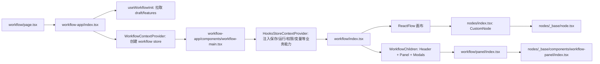

# Dify Workflow 前端系统学习报告

生成时间：2026-07-06

研究对象：

- Dify 本地仓库：`/Users/lijiarui/Downloads/dify`
- Dify 分支：`main`
- Dify 提交：`64d72c6f`
- 当前项目：`/Users/lijiarui/Downloads/阿里nuwax/agent-backend-demo`

本报告只研究 Dify workflow 前端的代码组织、交互模型和可迁移设计，不建议把 Dify 的 React/Next.js/ReactFlow 代码直接搬入当前项目。当前项目仍应保持 no-build 静态前端。

## 1. 结论摘要

Dify 的 workflow 编辑器不是简单的“节点表单 + 连线”。它的核心设计是：

1. **画布层通用化**：ReactFlow 只负责节点、边、拖拽、缩放、选中、连线等通用画布能力。
2. **节点类型注册表**：每类节点都有 `node.tsx`、`panel.tsx`、`types.ts`，再通过 `NodeComponentMap` 和 `PanelComponentMap` 统一注册。
3. **右侧面板统一壳**：所有节点的右侧配置面板都包在同一个 BasePanel 中，节点只填自己的业务表单。
4. **变量选择强约束**：用户不是随便填字符串，而是从“输入、系统变量、环境变量、会话变量、上游节点输出 schema”中选择变量。
5. **条件分支强约束**：条件节点以 `case_id + conditions + logical_operator` 表达 IF / ELIF / ELSE；操作符根据变量类型动态限制。
6. **运行态和编辑态分离**：运行时通过 SSE 事件更新 `_runningStatus`、`_runningBranchId` 等临时字段；保存草稿时会删除 `_` 开头临时字段。
7. **业务 app 与通用 workflow 分层**：`workflow-app` 负责 app 草稿、权限、运行 URL、发布等业务上下文；`workflow` 组件负责通用画布编辑器。

对当前项目最值得学习的是 **产品结构和数据约束模型**，不是技术栈。我们应模仿 Dify 的“统一右侧面板 + 节点注册表 + 变量选择器 + 条件 case 模型”，但仍用当前的原生 JS/CSS 静态资源实现。

## 2. 代码入口与调用链

Dify workflow 页面入口：

- `/Users/lijiarui/Downloads/dify/web/app/(commonLayout)/app/(appDetailLayout)/[appId]/workflow/page.tsx`
- 页面只渲染 `WorkflowApp`。

主要调用链：



这条链路说明 Dify 做了两层拆分：

- `workflow-app`：面向“某个 app 的 workflow”，负责业务数据、权限、运行和保存。
- `workflow`：面向“通用 workflow 编辑器”，负责画布、节点、边、面板和交互。

当前项目如果继续做 Dify-like 页面，也建议保持类似分层：

- `state.js` / `workflow.js`：只管通用画布状态与渲染。
- 后端 API / app 绑定 / demo seed：作为业务层输入，不应该把客服场景写死到基础编辑器里。

## 3. Dify 技术栈与依赖

Dify 前端位于 `/Users/lijiarui/Downloads/dify/web`，`package.json` 显示它是完整构建型前端：

- Next.js
- React
- TypeScript
- ReactFlow
- Zustand
- Zundo undo/redo
- Jotai
- TanStack Query
- Tailwind / `@langgenius/dify-ui`
- `react-sortablejs`
- `immer`
- SSE 客户端工具

这套技术栈不适合直接迁移到当前项目，因为当前项目的明确约束是：

- 不引入 React / Vite / Node build。
- 前端使用 `window.AgentWorkbench = window.AgentWorkbench || {}` namespace。
- 静态资源由 Spring Boot 直接提供。

可迁移的是 Dify 的交互结构和数据模型，而不是依赖栈。

## 4. 目录结构观察

Dify workflow 相关目录：

- `/Users/lijiarui/Downloads/dify/web/app/components/workflow`
- `/Users/lijiarui/Downloads/dify/web/app/components/workflow-app`
- `/Users/lijiarui/Downloads/dify/web/service/workflow.ts`

关键文件：

- `/Users/lijiarui/Downloads/dify/web/app/components/workflow/index.tsx`
  - 通用 ReactFlow 画布。
  - 注册 nodeTypes / edgeTypes。
  - 绑定拖拽、连线、选中、复制、快捷键、注释、同步草稿。

- `/Users/lijiarui/Downloads/dify/web/app/components/workflow-app/index.tsx`
  - 拉取 workflow draft。
  - 初始化节点和边。
  - 注入 app 级 store slice。

- `/Users/lijiarui/Downloads/dify/web/app/components/workflow-app/components/workflow-main.tsx`
  - 注入 hooks store。
  - 把 `doSyncWorkflowDraft`、`handleRun`、`handleStartWorkflowRun`、权限、变量 inspect 等传给通用 workflow。

- `/Users/lijiarui/Downloads/dify/web/app/components/workflow/nodes/components.ts`
  - 节点组件和面板组件的集中注册表。

- `/Users/lijiarui/Downloads/dify/web/app/components/workflow/nodes/index.tsx`
  - `CustomNode` 根据节点类型渲染对应节点。
  - `Panel` 根据节点类型渲染对应右侧配置面板。

- `/Users/lijiarui/Downloads/dify/web/app/components/workflow/nodes/_base/node.tsx`
  - 通用节点卡片壳，包括 icon、标题、连接点、运行状态、选中状态等。

- `/Users/lijiarui/Downloads/dify/web/app/components/workflow/nodes/_base/components/workflow-panel/index.tsx`
  - 通用右侧面板壳，包括标题、描述、设置 tab、上次运行 tab、单步运行、关闭按钮、下一步区域。

- `/Users/lijiarui/Downloads/dify/web/app/components/workflow/nodes/if-else`
  - 条件分支节点的完整实现。

## 5. 节点系统设计

Dify 节点的基础数据结构在 `/Users/lijiarui/Downloads/dify/web/app/components/workflow/types.ts`。

核心概念：

- `BlockEnum`
  - 所有节点类型枚举，例如 Start、End、LLM、KnowledgeRetrieval、IfElse、Code、Tool、Iteration、Loop、HumanInput 等。

- `CommonNodeType`
  - 所有节点共享字段。
  - 包含标题、描述、节点类型、选中状态、运行态字段等。

- `ValueSelector`
  - 变量路径，类型是 `string[]`。
  - 例如 `[nodeId, "structured_output", "intent"]` 或 `["sys", "query"]`。

- `Branch`
  - 条件分支/分类分支的出边描述，包含 `id` 和 `name`。

Dify 节点目录基本都遵循同一模式：

```text
nodes/llm/node.tsx
nodes/llm/panel.tsx
nodes/llm/types.ts

nodes/if-else/node.tsx
nodes/if-else/panel.tsx
nodes/if-else/types.ts

nodes/tool/node.tsx
nodes/tool/panel.tsx
nodes/tool/types.ts
```

再通过 `/Users/lijiarui/Downloads/dify/web/app/components/workflow/nodes/components.ts` 注册：

- `NodeComponentMap`：节点卡片怎么画。
- `PanelComponentMap`：右侧配置面板怎么画。

这个设计非常值得当前项目借鉴。当前项目可以不使用 React，但可以建立类似的“节点目录/节点元数据注册表”：

```text
NodeCatalog[type] = {
  label,
  icon,
  color,
  defaultConfig,
  outputSchema,
  renderPanel,
  renderNodeSummary
}
```

这样可以避免条件面板、变量选择器、节点展示逻辑各自散落。

## 6. 画布交互模型

Dify 使用 ReactFlow 处理画布：

- 节点拖拽。
- 边连接。
- 选中节点。
- 缩放和平移。
- 自定义边。
- 自定义节点。
- 背景点阵。
- 节点运行状态更新。

关键代码在：

- `/Users/lijiarui/Downloads/dify/web/app/components/workflow/index.tsx`
- `/Users/lijiarui/Downloads/dify/web/app/components/workflow/hooks/use-nodes-interactions.ts`
- `/Users/lijiarui/Downloads/dify/web/app/components/workflow/hooks/use-edges-interactions.ts`

交互层的主要职责：

- `handleNodeDragStart / handleNodeDrag / handleNodeDragStop`
  - 控制拖拽、辅助线、父子节点约束、保存草稿。

- `handleNodeClick`
  - 设置节点选中状态，驱动右侧面板打开。

- `handleNodeConnect`
  - 创建 edge。
  - 校验不能自己连自己、不能跨不同父节点乱连、不能重复连线。
  - 写入 source/target handle 元数据。

- `handleEdgeDeleteByDeleteBranch`
  - 删除条件分支时，同步删除关联边。

当前项目自己实现了 DOM/SVG 画布，不应为了模仿 Dify 而引入 ReactFlow。但可以学习 Dify 的职责划分：

- 画布只负责节点/边可视化和交互。
- 节点配置只写入 `node.config`。
- 分支连线只认受控的 branch id，而不是任意字符串。

## 7. Store 与保存草稿

Dify 的 workflow store 在：

- `/Users/lijiarui/Downloads/dify/web/app/components/workflow/store/workflow/index.ts`
- `/Users/lijiarui/Downloads/dify/web/app/components/workflow/store/workflow/workflow-slice.ts`
- `/Users/lijiarui/Downloads/dify/web/app/components/workflow/store/workflow/node-slice.ts`
- `/Users/lijiarui/Downloads/dify/web/app/components/workflow/store/workflow/panel-slice.ts`
- `/Users/lijiarui/Downloads/dify/web/app/components/workflow/store/workflow/workflow-draft-slice.ts`

它使用 Zustand 组合多个 slice：

- Chat variables。
- Environment variables。
- Form state。
- Layout state。
- Node state。
- Panel state。
- Tool state。
- Version state。
- Draft sync state。
- Workflow runtime state。
- Comment/collaboration state。

保存草稿的关键逻辑在：

- `/Users/lijiarui/Downloads/dify/web/app/components/workflow-app/hooks/use-nodes-sync-draft.ts`
- `/Users/lijiarui/Downloads/dify/web/service/workflow.ts`

Dify 保存草稿前会做两件关键事情：

1. 从 ReactFlow 读取当前节点、边、viewport。
2. 删除节点和边上 `_` 开头的运行时字段。

这点很重要：`_runningStatus`、`_waitingRun`、`_runningBranchId` 这类字段只属于 UI 运行态，不应该保存进 workflow 定义。

当前项目也应该遵守这个分层：

- 可保存字段：`id`、`type`、`label`、`route`、`config`、`edges`。
- 不应保存字段：选中状态、hover 状态、运行中状态、临时高亮、拖拽中状态。

## 8. 运行与 SSE 事件处理

Dify 运行 workflow 的链路在：

- `/Users/lijiarui/Downloads/dify/web/app/components/workflow-app/hooks/use-workflow-start-run.tsx`
- `/Users/lijiarui/Downloads/dify/web/app/components/workflow-app/hooks/use-workflow-run.ts`
- `/Users/lijiarui/Downloads/dify/web/app/components/workflow/hooks/use-workflow-run-event`

运行流程：

1. 用户点击运行。
2. 前端先同步 draft。
3. 根据 app mode 和 trigger type 选择运行 URL。
4. 通过 SSE 发起运行。
5. 收到 workflow/node events 后更新运行态。
6. 节点卡片和边根据运行态高亮。

运行事件处理示例：

- workflow started：
  - 设置整体 running。
  - 所有节点设置 `_waitingRun`。

- node started：
  - 当前节点设置 `_runningStatus = Running`。
  - 关联入边设置运行状态。
  - 视口可滚动到正在运行节点。

- node finished：
  - 当前节点设置为 success / failed / exception。
  - 如果节点是 IfElse，则把后端输出的 `selected_case_id` 写入 `_runningBranchId`。
  - 如果节点是 QuestionClassifier，则把 `class_id` 写入 `_runningBranchId`。

这说明 Dify 的分支不是前端猜的，也不是模型直接操控连线。模型可以产生上游结构化结果，但真正走哪个分支由运行时固定规则输出 `selected_case_id`，前端只展示结果。

当前项目已经有 workflow SSE delta/cursor 后端能力。前端后续可以学习 Dify：

- 对每个 step 显示 started / succeeded / failed。
- 条件节点运行后高亮 true / false 或 case 分支。
- 不把运行态混入保存的 workflow definition。

## 9. 变量选择器设计

Dify 变量系统相关文件：

- `/Users/lijiarui/Downloads/dify/web/app/components/workflow/nodes/_base/hooks/use-available-var-list.ts`
- `/Users/lijiarui/Downloads/dify/web/app/components/workflow/hooks/use-workflow-variables.ts`
- `/Users/lijiarui/Downloads/dify/web/app/components/workflow/nodes/_base/components/variable/var-reference-picker.tsx`
- `/Users/lijiarui/Downloads/dify/web/app/components/workflow/nodes/_base/components/variable/var-reference-vars.tsx`
- `/Users/lijiarui/Downloads/dify/web/app/components/workflow/nodes/_base/components/variable/utils.ts`
- `/Users/lijiarui/Downloads/dify/web/app/components/workflow/constants.ts`

变量来源：

- Start 节点输入变量。
- Chat 模式的 `sys.query`、`sys.files`。
- 全局系统变量，例如 `sys.user_id`、`sys.app_id`、`sys.workflow_id`、`sys.workflow_run_id`。
- 环境变量 `env.*`。
- 会话变量 `conversation.*`。
- 上游节点输出。
- LLM 结构化输出 schema。
- Tool / HTTP / Code / KnowledgeRetrieval 等节点定义的输出。
- Iteration / Loop 当前 item/index。

关键设计：

- `useAvailableVarList(nodeId)` 会找当前节点之前的可用节点。
- `getNodeAvailableVars()` 把这些节点转成可选变量。
- `ValueSelector` 是路径数组，不是随便拼字符串。
- 如果输出是 object，会继续展开子字段。
- 操作符和输入框会根据变量类型变化。

对当前项目的直接启发：

- 不要把变量选择写成固定的“用户消息 / 上一步输出 / 客服意图”等文案。
- 变量选择应该从当前画布状态动态推导。
- 节点输出应该有统一 schema。
- 条件左值/右值应该从变量选择器中选，允许高级自定义，但默认路径必须是产品化选择。

当前项目已有基础：

- `/Users/lijiarui/Downloads/阿里nuwax/agent-backend-demo/src/main/resources/static/js/state.js`
  - `VARIABLE_PRESETS`
  - `DEFAULT_NODE_OUTPUT_FIELDS`
  - `nodeVariableOptions()`
  - `nodeOutputDescriptors()`
  - `outputSchemaFieldDescriptors()`

但仍有差距：

- 变量类型没有统一建模。
- 输出 schema 没有作为所有节点的中心契约。
- 条件操作符没有按变量类型动态收窄。
- 变量 selector 仍以模板字符串为主，不是结构化路径。

## 10. 条件节点深度分析

Dify 条件节点相关文件：

- `/Users/lijiarui/Downloads/dify/web/app/components/workflow/nodes/if-else/types.ts`
- `/Users/lijiarui/Downloads/dify/web/app/components/workflow/nodes/if-else/panel.tsx`
- `/Users/lijiarui/Downloads/dify/web/app/components/workflow/nodes/if-else/use-config.ts`
- `/Users/lijiarui/Downloads/dify/web/app/components/workflow/nodes/if-else/use-config.helpers.ts`
- `/Users/lijiarui/Downloads/dify/web/app/components/workflow/nodes/if-else/utils.ts`
- `/Users/lijiarui/Downloads/dify/web/app/components/workflow/nodes/if-else/components/condition-wrap.tsx`
- `/Users/lijiarui/Downloads/dify/web/app/components/workflow/nodes/if-else/components/condition-list/index.tsx`
- `/Users/lijiarui/Downloads/dify/web/app/components/workflow/nodes/if-else/components/condition-list/condition-item.tsx`
- `/Users/lijiarui/Downloads/dify/web/app/components/workflow/nodes/if-else/components/condition-list/condition-var-selector.tsx`
- `/Users/lijiarui/Downloads/dify/web/app/components/workflow/nodes/if-else/components/condition-list/condition-operator.tsx`
- `/Users/lijiarui/Downloads/dify/web/app/components/workflow/nodes/if-else/components/condition-list/condition-input.tsx`

### 10.1 数据模型

Dify 的 IfElse 节点不是单个 `left/operator/right`，而是：

- `cases`
  - 每个 case 对应 IF 或 ELIF。
  - 每个 case 有唯一 `case_id`。

- `logical_operator`
  - `and` 或 `or`。
  - 表示 case 内多条件如何组合。

- `conditions`
  - 每条 condition 包含：
    - `variable_selector`
    - `varType`
    - `comparison_operator`
    - `value`
    - 可选 `sub_variable_condition`

- `_targetBranches`
  - 用于前端分支连线。
  - IF / ELIF / ELSE 都是明确 branch。

### 10.2 操作符按类型收窄

`/Users/lijiarui/Downloads/dify/web/app/components/workflow/nodes/if-else/utils.ts` 中的 `getOperators(type)` 体现了强约束：

- string：
  - contains / not contains / start with / end with / is / is not / empty / not empty

- number：
  - = / ≠ / > / < / ≥ / ≤ / empty / not empty

- boolean：
  - is / is not

- file：
  - exists / not exists

- array：
  - contains / not contains / empty / not empty

- arrayFile：
  - contains / not contains / all of / empty / not empty

这就是“模型只能做我想让它做的”的前端基础：用户配置阶段就不允许为 number 选 contains，也不允许为 boolean 填任意字符串比较。

### 10.3 条件右值也受控

条件右值不是永远一个文本框：

- string：文本/变量输入。
- number：数字输入，且可与数字变量比较。
- boolean：布尔选择。
- enum/file 类型：下拉选择。
- arrayFile：可以继续配置子变量条件。

这比当前项目的 `left/operator/right` 文本输入更强。

### 10.4 分支不是模型自由选择

正确解释方式：

- 模型节点可以作为上游节点生成结构化输出，例如 `{ intent: "refund" }`。
- 条件节点读取这个结构化输出。
- 条件节点用固定规则判断。
- 后端运行时输出选中的 case。
- 前端只根据 `selected_case_id` 高亮分支。

所以，验收时可以明确说：

> 模型不直接决定下一条边。模型只负责在受提示词和 schema 约束下产出字段；条件节点根据配置的 deterministic rule 决定 IF / ELSE / ELIF。

当前项目也应朝这个方向收敛。

## 11. 右侧面板设计

Dify 的右侧面板有几个重要产品细节：

- 面板是固定在右侧的可调整宽度区域。
- 顶部有节点 icon、标题输入、描述输入、关闭按钮、单步运行按钮。
- 面板主体使用 tab：
  - 设置。
  - 上次运行。
- 底部/后段展示“下一步”，让用户能从当前节点继续添加节点。
- 各节点只实现自己的配置内容，不重复写面板壳。

当前项目右侧检查器目前集中在：

- `/Users/lijiarui/Downloads/阿里nuwax/agent-backend-demo/src/main/resources/static/js/workflow.js`
  - `renderInspector()`
  - `renderConditionNodeConfig()`
  - `renderEdgeEditor()`

- `/Users/lijiarui/Downloads/阿里nuwax/agent-backend-demo/src/main/resources/static/js/state.js`
  - `conditionRuleControl()`
  - `renderSingleConditionRule()`
  - `renderCompositeConditionRule()`
  - `createVariableSelect()`

建议下一步把右侧面板抽象成：

```text
renderInspectorShell(node)
  renderPanelHeader(node)
  renderPanelTabs(node)
  renderNodeSpecificConfig(node)
  renderNextStep(node)
```

这仍然可以用原生 DOM 实现，不需要 React。

## 12. 当前项目对照分析

当前项目关键文件：

- `/Users/lijiarui/Downloads/阿里nuwax/agent-backend-demo/src/main/resources/static/js/state.js`
- `/Users/lijiarui/Downloads/阿里nuwax/agent-backend-demo/src/main/resources/static/js/workflow.js`
- `/Users/lijiarui/Downloads/阿里nuwax/agent-backend-demo/src/main/resources/static/js/ui.js`
- `/Users/lijiarui/Downloads/阿里nuwax/agent-backend-demo/src/main/resources/static/styles.css`
- `/Users/lijiarui/Downloads/阿里nuwax/agent-backend-demo/src/test/java/com/example/agentdemo/FrontendStaticAssetsTest.java`

当前项目已经具备：

- 静态 JS 模块化。
- 节点 palette。
- 节点技术 ID。
- 节点 label / route。
- 自定义 DOM/SVG 画布。
- 条件节点的单条件、多条件配置。
- 变量选择下拉。
- 节点输出字段和结构化 schema 展开。
- 条件边的 true / false 选择。
- 前端静态资源测试。

当前项目主要差距：

1. **变量模型还不够统一**
   - 现在有 `VARIABLE_PRESETS` 和 `DEFAULT_NODE_OUTPUT_FIELDS`，但还不是统一的 `WorkflowVariableRegistry`。

2. **条件模型还偏旧**
   - 当前仍以 `left/operator/right` 和 `conditions[]` 兼容模型为主。
   - Dify 是 `cases[] + case_id + logical_operator + conditions[]`。

3. **操作符没有按变量类型严格收窄**
   - 当前 operator 是固定列表。
   - Dify 会根据 string/number/boolean/file/array 动态收窄。

4. **分支连线还没有 case 级 branch**
   - 当前 condition edge 是 `true/false`。
   - Dify 支持 IF / ELIF / ELSE，每条分支都有 handle id。

5. **右侧面板缺少统一产品壳**
   - 目前检查器已经可用，但结构还像配置表单集合。
   - Dify 更像“节点详情页”：标题、描述、设置、上次运行、下一步。

## 13. 推荐落地路线

在不引入 React/Vite/Node build 的前提下，建议按以下顺序改。

### 阶段 1：建立节点目录和变量注册表

目标文件：

- `/Users/lijiarui/Downloads/阿里nuwax/agent-backend-demo/src/main/resources/static/js/state.js`

建议新增或整理：

```text
NODE_CATALOG = {
  start: {
    label,
    icon,
    defaultConfig,
    outputSchema
  },
  llm: {
    label,
    defaultConfig,
    outputSchema(config)
  },
  condition: {
    label,
    defaultConfig,
    branchSchema
  }
}
```

同时收敛：

- `NODE_LABELS`
- `NODE_ICONS`
- `DEFAULT_NODE_OUTPUT_FIELDS`
- `fallbackSchemas`
- `VARIABLE_LABELS`

避免同一个概念散落多份。

### 阶段 2：实现 WorkflowVariableRegistry

目标文件：

- `/Users/lijiarui/Downloads/阿里nuwax/agent-backend-demo/src/main/resources/static/js/state.js`

职责：

- 根据当前 selected node 找上游节点。
- 生成变量分组：
  - 输入变量。
  - 系统变量。
  - 上游节点输出。
  - 结构化输出字段。
- 返回统一 descriptor：

```text
{
  value: "{{nodes.llm_1.parsed.intent}}",
  selector: ["nodes", "llm_1", "parsed", "intent"],
  label: "识别意图 · 结构化 · intent",
  type: "string",
  sourceNodeId: "llm_1"
}
```

这样从 0 新建 workflow 时，变量来源会随画布变化，不再依赖客服模板。

### 阶段 3：条件编辑器改成 Dify-like case 模型

目标文件：

- `/Users/lijiarui/Downloads/阿里nuwax/agent-backend-demo/src/main/resources/static/js/state.js`
- `/Users/lijiarui/Downloads/阿里nuwax/agent-backend-demo/src/main/resources/static/js/workflow.js`
- `/Users/lijiarui/Downloads/阿里nuwax/agent-backend-demo/src/main/resources/static/styles.css`

建议数据结构：

```json
{
  "cases": [
    {
      "caseId": "case_1",
      "name": "IF",
      "mode": "all",
      "conditions": [
        {
          "left": "{{nodes.llm_intent.parsed.intent}}",
          "leftType": "string",
          "operator": "equals",
          "right": "product_consult",
          "rightType": "constant",
          "caseSensitive": false
        }
      ]
    }
  ],
  "elseCaseId": "false"
}
```

兼容当前后端时，可以做 adapter：

- 单 IF/ELSE：继续落到原来的 `left/operator/right`。
- 多条件：继续落到 `conditions[]`。
- UI 内部先按 case 模型组织。
- 后端支持 ELIF 前，前端可以先隐藏或禁用 ELIF。

### 阶段 4：操作符按变量类型收窄

建议建立：

```text
OPERATORS_BY_TYPE = {
  string: ["contains", "notContains", "startsWith", "endsWith", "equals", "notEquals", "exists", "notExists"],
  number: ["equals", "notEquals", "greaterThan", "lessThan", "greaterThanOrEqual", "lessThanOrEqual", "exists", "notExists"],
  boolean: ["equals", "notEquals"],
  array: ["contains", "notContains", "exists", "notExists"],
  object: ["exists", "notExists"]
}
```

选择左值后：

- 自动识别 type。
- 重置非法 operator。
- 右值控件跟着变化。

### 阶段 5：统一右侧面板壳

目标文件：

- `/Users/lijiarui/Downloads/阿里nuwax/agent-backend-demo/src/main/resources/static/js/workflow.js`
- `/Users/lijiarui/Downloads/阿里nuwax/agent-backend-demo/src/main/resources/static/styles.css`

建议结构：

```text
节点标题区
  icon + 节点名称
  运行按钮 / 关闭按钮

基础信息
  显示名称
  技术 ID
  所属流程

Tabs
  设置
  上次运行

设置
  节点专属配置

下一步
  IF / ELSE 分支目标
  添加下一个节点
```

这会比当前“所有配置字段直接堆在右侧”更接近 Dify。

### 阶段 6：测试

目标文件：

- `/Users/lijiarui/Downloads/阿里nuwax/agent-backend-demo/src/test/java/com/example/agentdemo/FrontendStaticAssetsTest.java`

建议补测试：

- 变量注册表关键字符串存在。
- 条件 case model 关键字段存在。
- 操作符按类型收窄的配置存在。
- `WorkflowCanvasController` 兼容名仍存在。
- no-build script 顺序不变。
- 右侧面板基础中文文案存在。

## 14. 验收时的技术讲法

可以这样向懂代码的人解释：

1. **节点不是任意表单**
   - 每类节点有固定 schema。
   - schema 决定可编辑字段、默认值、输出变量。

2. **模型不是流程控制器**
   - 模型只在 LLM 节点内工作。
   - 它可以产出文本或结构化 JSON。
   - 下一步走哪条边由条件节点的固定规则决定。

3. **条件节点是 deterministic if/else**
   - 条件左值来自输入或上游节点输出。
   - 操作符是受限枚举。
   - 右值可以是固定值或变量。
   - 多条件按 all/any 组合。

4. **复杂上下文靠变量图，不靠“只看上一步”**
   - Dify 的变量选择器会枚举当前节点之前所有可用节点输出。
   - 因此未来可以引用上一步、上上步、任意上游节点、系统变量、环境变量。
   - 当前项目应从 `lastOutput` 逐步升级到 `nodes.nodeId.field` 和结构化 selector。

5. **运行态和定义态分离**
   - workflow definition 是稳定定义。
   - run trace / step status 是运行态。
   - 前端可以高亮运行分支，但不会把运行高亮写回定义。

## 15. 不建议直接照搬的部分

不建议直接迁移：

- Next.js app router。
- ReactFlow。
- Zustand / Zundo / Jotai。
- Dify UI 组件库。
- Dify collaboration / websocket / CRDT。
- Plugin marketplace 相关复杂逻辑。
- 大量 Dify 专用 i18n、权限、workspace、team 逻辑。

原因：

- 当前项目不是构建型前端。
- 当前项目后端 API 和 Dify 不同。
- 直接迁移会破坏现有静态资源测试和 Spring Boot 部署方式。
- 当前需求是验收 demo 和产品化编辑体验，不是复制 Dify 产品全量能力。

## 16. 最小可行改造方案

如果只为近期验收，建议优先做这 4 件：

1. **右侧条件面板 Dify-like 重排**
   - IF 区块。
   - 条件列表。
   - ELSE 区块。
   - 下一步。
   - 高级 JSON 折叠。

2. **变量来源改为动态图**
   - 下拉内容来自当前画布节点输出。
   - 保留“自定义模板 / 固定值”作为高级项。

3. **操作符按类型过滤**
   - 先支持 string / number / boolean / object。
   - 不需要一次支持 Dify 的 file/arrayFile 全量能力。

4. **测试锁住中文文案和 no-build 兼容**
   - 防止后续改乱页面。

这样能快速解决当前体验问题：

- 不再挤压。
- 不再客服场景写死。
- 不再所有内容靠手填。
- 条件节点更像产品，而不是 JSON 编辑器。

## 17. 证据清单

本次实际阅读/检索的主要命令：

```bash
git -C /Users/lijiarui/Downloads/dify rev-parse --short HEAD
git -C /Users/lijiarui/Downloads/dify branch --show-current
sed -n '1,220p' web/package.json
sed -n '1,220p' web/app/components/workflow-app/index.tsx
sed -n '1,300p' web/app/components/workflow-app/components/workflow-main.tsx
sed -n '1,280p' web/app/components/workflow/index.tsx
sed -n '1,260p' web/app/components/workflow/nodes/components.ts
sed -n '1,240p' web/app/components/workflow/nodes/index.tsx
sed -n '1,280p' web/app/components/workflow/store/workflow/index.ts
sed -n '1,280p' web/app/components/workflow-app/hooks/use-workflow-run.ts
sed -n '1,300p' web/app/components/workflow-app/hooks/use-workflow-start-run.tsx
sed -n '1,300p' web/app/components/workflow/nodes/_base/hooks/use-available-var-list.ts
sed -n '1,320p' web/app/components/workflow/hooks/use-workflow-variables.ts
sed -n '1,260p' web/app/components/workflow/nodes/if-else/types.ts
sed -n '1,320p' web/app/components/workflow/nodes/if-else/utils.ts
sed -n '1,260p' web/app/components/workflow/nodes/if-else/use-config.helpers.ts
sed -n '1,300p' web/app/components/workflow/nodes/if-else/components/condition-list/condition-item.tsx
sed -n '1,260p' src/main/resources/static/js/workflow.js
sed -n '1,220p' src/main/resources/static/js/state.js
rg -n "condition|left|operator|right|technical|技术|变量|条件|renderWorkflow|WorkflowCanvasController" src/main/resources/static/js src/main/resources/static/styles.css src/test/java/com/example/agentdemo/FrontendStaticAssetsTest.java
```
